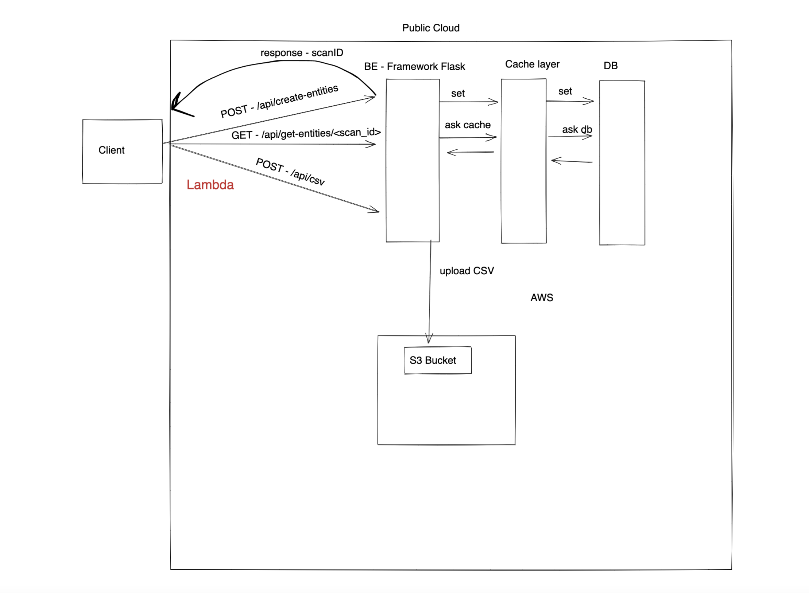

# GoRest

Go Rest ApI




## Installation

1) Config .env file according your credentials

Using docker compose

```bash
git clone https://github.com/danielei12e/GoRest-App.git
docker-compose up --build
```

Using local 

```bash
git clone https://github.com/danielei12e/GoRest-App.git
pip3 install requirements.txt
python3 run.py
```

Running Tests
```bash
python3 -m pytest tests.py
```

## Usage Swagger 
Go to http://localhost:5000/

